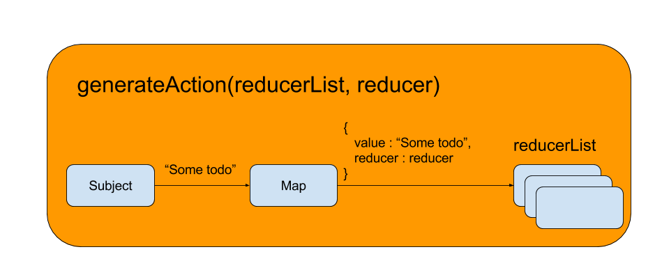

# Redux-ive

``THIS IS JUST A STUDY PROJECT``

This simple project try to rewrite the redux model using the RxJs library, is just a study case done to learn how to work with RxJS and use it as a full replacement of the action/store layer for a flux/redux application.


## Quick start

```
npm install
npm start
```

The script uses ES6/ES7 features.

## The app
The sample app is the classical ToDO app. 
It provide 3 actions to 

* add
* toggle
* remove

a todo action.

## How it works
In the ```src/redux-ive.js``` there are 2 method.

```generateAction``` and ```runDispatcher```

### generateAction(reducerList, reducer)

Is a shortcat to create a Rx.Subject and wrap it in an action that when i called, simply calls ```actionEvent.onNext(value)``` and map  the reducer with the value and add it in the reduceList array.



```
export function generateAction(reducerList, reducer) {
  var actionEvent = new Rx.Subject();

  reducerList.push(actionEvent.map(value => {
    return {value, reducer}
  }));

  return (value) => actionEvent.onNext(value)
}
```

### runDispatcher(initialStatus, reducerList)

Create an observable that merge the list of the reducers and scan on every change returning the new state.


```
export function runDispatcher(initialStatus, reducerList) {
  return Rx.Observable.merge.apply(null, reducerList)
      .scan((state, curr) => {
        if (curr.reducer) {
          state = curr.reducer(state, curr.value);
        }
        return state;
      }, initialStatus)
      .share();
}
```

## Create a quick sample
A sample to create a counter.

```
// Define the initial status
var initialStatus = {
  current: 0
};

// Create some actions
var reducerList = [];
var incrementAction  = generateAction(reducerList, (state, value) => {
  state.current += value;
  return state;
});

var decrementAction  = generateAction(reducerList, (state, value) => {
  state.current -= value;
  return state;
});

// Run the dispatcher
runDispatcher(initialStatus, reducerList)
    .subscribe(value => console.log('currentStatus', value));

// Call some action
incrementAction(1);
// {current : 1}
incrementAction(3);
// {current : 4}
decrementAction(1);
// {current : 3}
```


